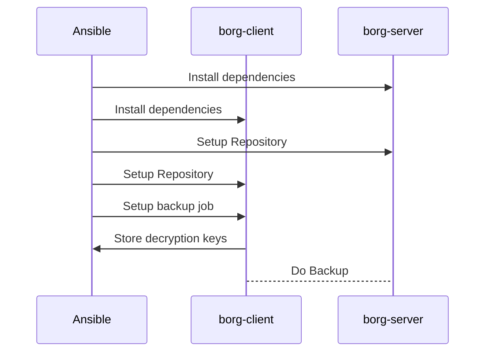

Ansible Role: BorgBackup
========================

An Ansible role that installs and configures a systemd service for BorgBackup on
a client and (delegated) server.
This allows you to very easily add backups to your hosts.

The documentation assumes basic knowledge about BorgBackup. You can get up to
speed with Borg by reading their excellent documentation on
<https://borgbackup.readthedocs.io>.

How it works
------------



Installation
------------

via ansible-galaxy

```sh
ansible-galaxy collection install kliwniloc.borgbackup
```

```yaml
# requirements.yml
- src: kliwniloc.borgbackup
```

via git

```sh
ansible-galaxy collection install git+https://github.com/kliwniloc/ansible-role-borgbackup.git,main
```

```yaml
# requirements.yml
- src: https://github.com/kliwniloc/ansible-role-borgbackup
  version: master
  name: kliwniloc.borgbackup
```

Role Variables
--------------

For (much) more details see `defaults/main.yml`

```yaml
################################### Required ###################################
# The borg server host to delegate the server tasks to
borg_server_host: ""

# The public ssh key of the borg server
borg_server_host_ssh_key: ""

################################### Optional ###################################
# The borg server host to push backups to as it will be used in the backup job
borg_server_host_url: "{{ borg_server_host }}"

# The repository name that the borg repository is created
borg_backup_name_format: "{hostname}-{now:%Y-%m-%dT%H:%M:%S}"

# Location for repositories on the borg server
borg_server_user_home: /opt/borg

# Name for the repository (unique on borg server)
borg_repo_name: "{{ inventory_hostname }}"

# Borg backup name format (for cron job)
borg_backup_name_format: "{hostname}-{now:%Y-%m-%dT%H:%M:%S}"

# Should the repo be append only?
borg_mode_append_only: false

# What compression to use in the backup?
borg_compression: zstd

# Directories to include in the backup
borg_included_dirs: []

# Directories to exclude in the backup
borg_excluded_dirs: []

# Passphrase to use with borg
borg_passphrase: ""

# Where to store the decryption keys on the local machine
borg_decryption_keys_yaml_path: "{{ inventory_dir }}/decryption_keys.yml"

# Settings for the backup cron job
borg_cron_time:
  minute: 0
  hour: 3
```

Example Playbooks
-----------------

Simple Playbook

```yaml
- name: >
    Add Borg backup to the borg-client and save the
    decryption keys alongside the playbook
  hosts: borg-client
  roles:
    - role: kliwniloc.borgbackup
      borg_server_host: borg-server
      borg_server_host_ssh_key: ssh-rsa AAAAAAAA...
      borg_decryption_keys_yaml_path: "{{ playbook_dir }}/decryption_keys.yml"
      borg_included_dirs:
        - /home
        - /opt/project
```

Multiple Backup servers

```yaml
- name: >
    Add Borg backup with multiple borg servers to the borg-client and
    save the decryption keys alongside the playbook
  hosts: borg-client
  vars:
    borg_included_dirs:
      - /home
      - /opt/project
  roles:
    - role: kliwniloc.borgbackup
      borg_server_host: borg-server1
      borg_server_host_ssh_key: ssh-rsa AAAAAAAA...
    - role: kliwniloc.borgbackup
      borg_server_host: borg-server2
      borg_server_host_ssh_key: ssh-rsa BBBBBBBB...
```

Dependencies
------------

None.

License
-------

MIT
