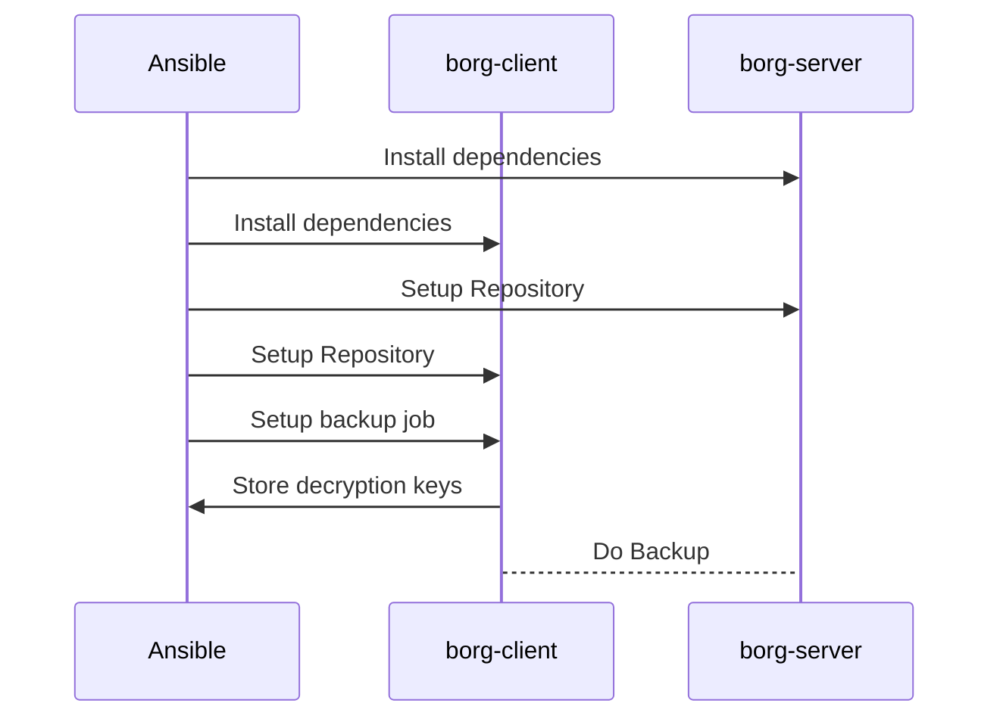

Ansible Role: BorgBackup
========================

An Ansible role that installs and configures a systemd service for BorgBackup on
a client and (delegated) server.
This allows you to very easily add backups to your hosts.

The documentation assumes basic knowledge about BorgBackup. You can get up to
speed with Borg by reading their excellent documentation on
<https://borgbackup.readthedocs.io>.

How it works
------------



Installation
------------

via ansible-galaxy

```sh
ansible-galaxy role install kliwniloc.borgbackup
```

```yaml
# requirements.yml
- src: kliwniloc.borgbackup
```

via git

```sh
ansible-galaxy role install git+https://github.com/kliwniloc/ansible-role-borgbackup.git,master
```

```yaml
# requirements.yml
- src: https://github.com/kliwniloc/ansible-role-borgbackup
  version: master
  name: kliwniloc.borgbackup
```

Role Variables
--------------

For more details, see: [`defaults/main.yml`](defaults/main.yml)

You need to specify your Borg hostname (as defined in your Ansible inventory)
as well as the public SSH key from that Borg SSH server.
You can get this key by scanning the Borg server host like this:
`ssh-keyscan -t rsa borg.example.org` and removing the hostname, so the output
looks like this:
`ssh-rsa AAAAAAAAAAAAAAAAAAAAAAAAAAAAAAAAAAAAAAAAAAAAAAAAAAAA...`.

If the Ansible hostname is not reachable from the client host, you must set
`borg_server_host_url` to a host that is reachable from the Borg clients. It
will default to `borg_server_host`.

> - `borg_server_host` is used by Ansible to delegate tasks to the Borg server
> - `borg_server_host_url` is used by the client to connect to the Borg server

```yaml
borg_server_host: "" # Required
borg_server_host_ssh_key: "" # Required
borg_server_host_url: {{ borg_server_host }} # Optional
```

The role creates a user for the Borg repositories on the Borg server. You can
specify the location of the home directory with `borg_server_user_home`, which
will also be the location for the backups.

```yaml
borg_server_user_home: /opt/borg
```

For the backup itself, there are a few Borg parameters you can configure.
Not all options that Borg offers are available in the Ansible role yet. For more
configuration options, see <https://borgbackup.readthedocs.io>.

`borg_repo_name` configures the name of the repository as it is created on the
Borg server in the `borg_server_user_home` directory. By default, we use the
inventory hostname, which is fine if you don't use multiple Borg repositories on
the same client and server hosts.
The individual backup names can be customized in the `borg_backup_name_format`
variable. You can use placeholders such as `{hostname}` for the backups, see:
<https://borgbackup.readthedocs.io/en/stable/usage/help.html#borg-help-placeholders>.

`borg_mode_append_only` restricts the deletion of the backups from the client.
This can increase security but comes at the cost of not being able to clean up
old backups from the client.

```yaml
borg_repo_name: "{{ inventory_hostname }}"
borg_backup_name_format: "{hostname}-{now:%Y-%m-%dT%H:%M:%S}"
borg_mode_append_only: false # Server side append only config
```

We use zstd compression by default, but you can change it to any of the
supported modes see:
<https://borgbackup.readthedocs.io/en/stable/usage/help.html#borg-help-compression>.

You can configure a passphrase for the encryption keys in `borg_passphrase`of
your Borg backups, but it is not used by default.

`borg_included_dirs` and `borg_excluded_dirs` finally picks what directories
will be backed up by Borg.

```yaml
borg_compression: zstd # -C argument
borg_passphrase: "" # Env variable
borg_included_dirs: [] # Positional arguments
borg_excluded_dirs: [] # --exclude arguments
```

To decrypt your backups without the client, we store the decryption keys in a
YAML file in your Ansible repository. You require the decryption keys as well as
access to the repository files on the Borg server to access the backups.
If you wish to add another layer of security for these decryption keys, consider
using git encryption tools like <https://github.com/AGWA/git-crypt> or storing
the keys in a secure location outside of git.

```yaml
borg_decryption_keys_yaml_path: "{{ inventory_dir }}/decryption_keys.yml"
```

The scheduling of the backups is done via systemd. For this purpose a systemd
service and a corresponding timer are created.
Additionally, we create backup scripts for use in the systemd service and for
the ability to easily trigger manual backups.

To support multiple backups (with different schedules), we have the
`borg_backup_argument` which defaults to `{{ borg_server_host_url }}` and should
be unique per backup target.
The names of the systemd service and timer are:
`{{ borg_backup_timer_name }}{{ borg_backup_argument }}.service` and
`{{ borg_backup_timer_name }}{{ borg_backup_argument }}.timer`.

For the backup scripts we add `{{ borg_backup_script_location }}` for creating a
backup on all specified targets and
`{{ borg_backup_script_location }}{{ borg_backup_argument }}` for backing up to
each target.

To configure the backup schedule, we offer `borg_systemd_oncalendar` and
`borg_systemd_accuracysec`, which map to the corresponding systemd options,
see man-page systemd.timer(5).

```yaml
borg_backup_script_location: /usr/local/bin/run_borg_backup
borg_backup_timer_name: borg_backup
borg_backup_service_name: borg_backup
borg_backup_argument: '{{ borg_server_host_url }}'
borg_systemd_oncalendar: '*-*-* 02:00:00'
borg_systemd_accuracysec: 60min
```

Example Playbooks
-----------------

Simple Playbook

```yaml
- name: >
    Add Borg backup to the borg-client and save the
    decryption keys alongside the playbook
  hosts: borg-client
  roles:
    - role: kliwniloc.borgbackup
      borg_server_host: borg-server
      borg_server_host_ssh_key: ssh-rsa AAAAAAAA...
      borg_decryption_keys_yaml_path: "{{ playbook_dir }}/decryption_keys.yml"
      borg_included_dirs:
        - /home
        - /opt/project
```

Multiple Backup servers

```yaml
- name: >
    Add Borg backup with multiple borg servers to the borg-client and
    save the decryption keys alongside the playbook
  hosts: borg-client
  vars:
    borg_included_dirs:
      - /home
      - /opt/project
  roles:
    - role: kliwniloc.borgbackup
      borg_server_host: borg-server1
      borg_server_host_ssh_key: ssh-rsa AAAAAAAA...
    - role: kliwniloc.borgbackup
      borg_server_host: borg-server2
      borg_server_host_ssh_key: ssh-rsa BBBBBBBB...
```

Dependencies
------------

None.

License
-------

MIT
